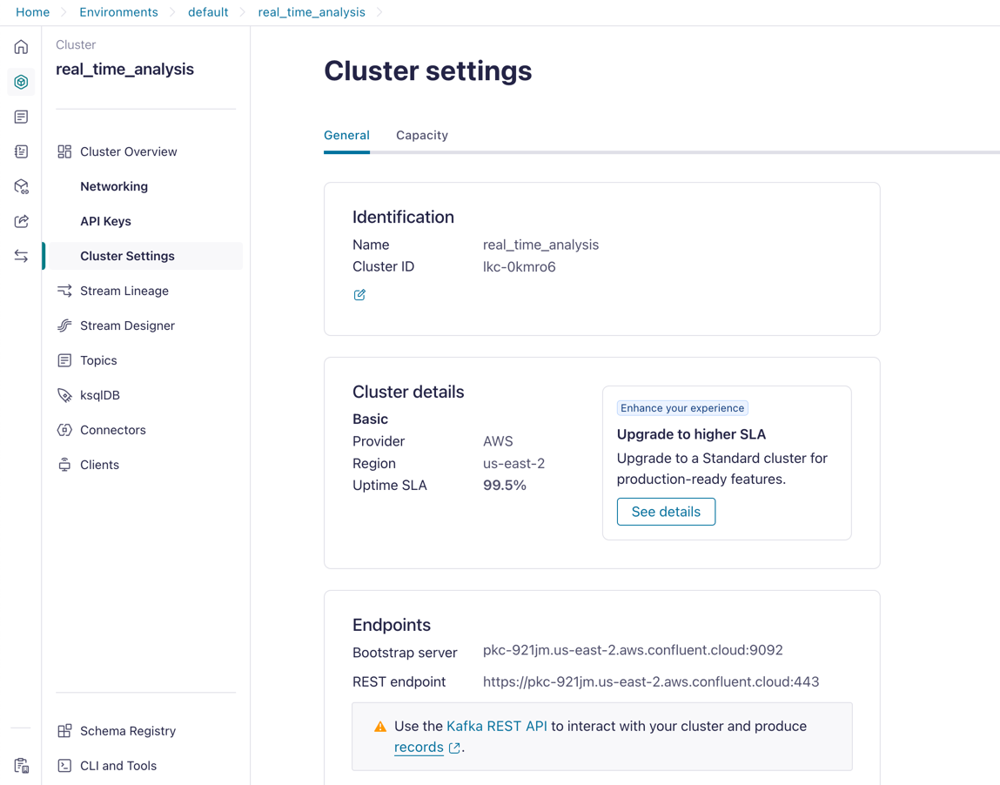
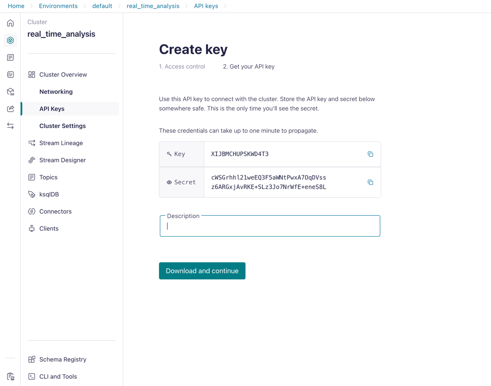

## Set up the project

### Create Account on confluent kafka cloud 
1.  Go to https://confluent.cloud/
2. Sing up and login
3. Add your card deailw while creating environment on confluent cloud
4. Create two topics "market_data" & "processed_data" in the cluster

<html>

</html>

5. Copy the bootstrap server details into the config_dev.py file in KAFKA_BROKER key
<html>

</html>

6. Similar way copy the API key and secret into the config_dev.py file in KAFKA_API_KEY and KAFKA_API_SECRET key

### Create Account on Databricks
1. Go to https://databricks.com/
2. Sing up and login
3. Create a cluster
4. Import the data_processing_v2.ipynb file into the databricks workspace
5. Run the notebook to when cluster start running.

### Add CA Certificate to Windows Trusted Store
If you prefer to use the Windows Root certificate store:
    Open the Windows Certificate Manager:
        1. Press Win + R, type certmgr.msc, and hit Enter.
        2. Import the CA certificate into Trusted Root Certification Authorities.
        3. Right-click on Trusted Root Certification Authorities > All Tasks > Import.
        3. Select the downloaded CA certificate file and follow the wizard to install it.

### Build and run this codebase (Windows)
1. python -m venv .venv
2. .\.venv\Scripts\activate
3. pip install -r .\requirements.txt
4. pip install .

### Sequence to run this project
1. First run producer in pycharm terminal using below command
   python .\producers\data_publisher.py
2. Second Run the databricks notebook
3. Third run consumer in new pycharm terminal using below command
    python .\consumers\data_consumer.py
    Then open the browser and go to  http://127.0.0.1:8050/ to see the dashboard

